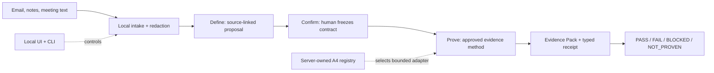

# ExitSpec

[](https://github.com/jayeshsuyal/ExitSpec/actions/workflows/tests.yml)
[](https://www.python.org/)
[](LICENSE)

**Turn a customer POC claim into a decision you can defend.**

ExitSpec is a local, source-neutral acceptance workbench for solutions
engineers, platform teams, and customer-facing AI infrastructure teams. It
turns a request into an exact agreement, proves only that agreement, and
packages the result as inspectable evidence.

## Who it is for

Use ExitSpec when someone asks, “Can this system meet our requirement?” and you
need one shared answer for customer, engineering, or leadership review.

## In 30 seconds

| Question | Answer |
| --- | --- |
| What is it? | A workbench for turning a customer requirement into a frozen contract, bounded proof, and typed decision. |
| Why does it matter? | Everyone reviews the same rule, evidence, calculation, limitations, and next action. |
| How do I run it? | Create a virtual environment, install ExitSpec, and open the local dashboard below. |
| What does the demo prove? | A deterministic synthetic support-agent criterion and its Evidence Pack, not a production system. |
| What does it not authorize? | Deployment, spending, procurement, production traffic, or any other external action. |

## See the product


*Current product surface from a clean local seeded demo. The sample data is
synthetic.*

> **Release status:** v0.5.1 is the current patch release. Its annotated
> `v0.5.1` tag and public GitHub release point to the exact green main commit.
> v0.5.0 remains the prior published release checkpoint; the v0.4 Routing
> Evidence Pack and v0.3 remain historical compatibility references.

## 60-second quickstart

```bash
python3.12 -m venv .venv
.venv/bin/python -m pip install -e .
.venv/bin/exitspec serve
```

Open [the local dashboard](http://127.0.0.1:8765/app), choose **Guided demo**,
and follow the seeded support-agent POC. For the narrated path, open the
[75-second guided demo](http://127.0.0.1:8765/app?mode=recording). Stop the
server with `Ctrl-C`.

The source-neutral browser product starts at `/app`. The v0.3, v0.4, and v0.5
checkpoint docs preserve the earlier contracts and current release boundary.

## Define → Confirm → Prove

1. **Define:** capture bounded source text, review source-linked proposals, and
   choose the measurable rule.
2. **Confirm:** show the exact customer-facing version, record acknowledgement,
   and freeze the contract before measurement.
3. **Prove:** run the approved evidence method, recalculate the typed verdict,
   inspect the Evidence Pack, and record a human handoff or stop decision.

The complete journey is **Capture → Review → Plan → Confirm → Prove → Decide**.
The local product keeps these stages separate so a source, provider, customer,
or adapter cannot silently become the authority for another stage.

## Compact architecture



The server owns lifecycle state. Its server-owned A4 registry selects the
approved adapter, profile, evidence method, population, and provenance. The UI
and CLI expose bounded controls; legacy routes and optional paths are
compatibility adapters and cannot choose lifecycle state, verdict, or
production action.

## What the guided demo proves

The seeded support-agent scenario evaluates 200 deterministic synthetic cases
against one frozen exact-tool-selection criterion. The sample result is
`197/200 (98.50%)`, with a Wilson lower bound of `95.68%`, producing `PASS`.
That result applies only to the frozen criterion and fixture; it is not a claim
about a production system.

The [three-minute demo runbook](docs/DEMO_RUNBOOK.md) explains the narrated
path and optional extensions. Inferdrome is the concise differentiator: its
offline `inferdrome.evidence.v1` importer verifies structure and exact-byte
hashes, rejects synthetic customer evidence, recalculates summaries, and binds
an admitted bundle to frozen context. See the
[Inferdrome import boundary](docs/INFERDROME_IMPORT.md).

## Authority boundary

ExitSpec can record a customer-confirmed contract, calculate a scoped evidence
verdict, and package inputs and limitations for review. Missing, invalid, or
insufficient evidence yields `BLOCKED` or `NOT_PROVEN`; sufficient valid
evidence can establish `PASS` or `FAIL`.

| Actor | May do | May not do |
| --- | --- | --- |
| Human POC owner | Define, revise, approve, reject, and freeze the rule | Turn missing evidence into a pass |
| Customer reviewer | Confirm the exact visible version or request changes | Create evidence or authorize production |
| Measurement adapter | Return bounded facts, receipts, and artifacts | Approve, freeze, or assign verdicts |
| ExitSpec verifier | Validate integrity and calculate the typed verdict | Make the final business or deployment decision |

A `PASS` is only a verdict for the frozen criterion. It does **not** authorize
deployment, spending, procurement, production traffic, shipping, or any other
external action. A named human remains responsible for the final handoff or
stop.

## Honest current limitations

- The browser product is local, loopback-only, single-process, synthetic, and
  process-local. Reviewer identity, confirmations, and lifecycle records are
  non-durable.
- Default capture and assisted-authoring paths make no provider call. Fireworks
  authoring and STT flags are disabled by default and experimental; no funded
  live STT success is claimed.
- The performance adapter covers one frozen OpenAI-compatible streaming workload
  with client-observed TTFT and error rate. No real vLLM or GPU result is
  claimed.
- There is no hosted identity, multi-tenant authorization, live mailbox or
  meeting connector, arbitrary upload, generic metric execution, durable
  confirmation service, or production deployment authorization.

## Curated documentation

- **Start:** [Architecture](docs/ARCHITECTURE.md) · [PRD](docs/PRD.md) ·
  [Golden Loop Contract](docs/GOLDEN_LOOP_CONTRACT.md) ·
  [Local E2E contract](docs/LOCAL_E2E_CONTRACT.md) ·
  [Engineering Playbook](docs/ENGINEERING_PLAYBOOK.md)
- **Contracts and boundaries:** [Contract specification](docs/CONTRACT_SPEC.md) ·
  [Source specification](docs/SOURCE_SPEC.md) ·
  [Measurement specification](docs/MEASUREMENT_SPEC.md) ·
  [Provider boundary](docs/PROVIDER_SPEC.md) ·
  [Security boundary](docs/SECURITY.md) ·
  [Redaction boundary](docs/REDACTION_SPEC.md)
- **Evidence and release:** [Inferdrome import](docs/INFERDROME_IMPORT.md) ·
  [v0.3 checkpoint](docs/RELEASE_V0_3.md) ·
  [v0.4 checkpoint](docs/RELEASE_V0_4.md) ·
  [v0.5 checkpoint](docs/RELEASE_V0_5.md) ·
  [v0.5.1 patch checkpoint](docs/RELEASE_V0_5_1.md)
- **Project:** [Contributing](CONTRIBUTING.md) ·
  [Security reporting](SECURITY.md) · [License](LICENSE)

Detailed meeting, Zoom, Fireworks STT, routing, external-evidence, and
historical-release material remains in the authoritative
[runbooks and protocol docs](docs/DEMO_PLAN.md).

## For contributors

ExitSpec requires Python 3.12+, SQLite 3.37+, and Node.js for JavaScript
syntax checks. Install development and browser dependencies, then run the same
gates used by CI:

```bash
python3.12 -m pip install -e '.[dev,browser]'
python3.12 -m playwright install chromium
./scripts/engineering_gate.sh
./scripts/v0_3_release_gate.sh
./scripts/v0_4_release_gate.sh
```

The v0.4 wrapper requires the exact Chromium collections and the complete
engineering gate to finish with zero skips, failures, or errors. The canonical
source-neutral server command is:

```bash
exitspec serve --source-neutral --open-browser
```

## License

Apache-2.0. See [LICENSE](LICENSE).
