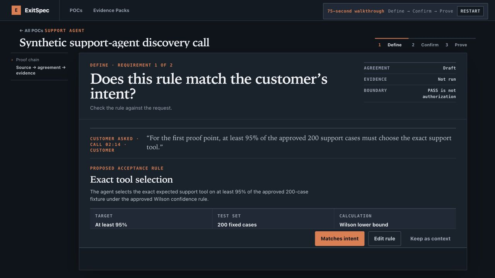

# ExitSpec

[](https://github.com/jayeshsuyal/ExitSpec/actions/workflows/tests.yml)
[](https://www.python.org/)
[](LICENSE)

**Turn a customer POC claim into a decision you can defend.**

ExitSpec is a local, source-neutral acceptance workbench for solutions
engineers, platform teams, and customer-facing AI infrastructure teams. It
turns a request into an exact agreement, proves only that agreement, and
packages the result as inspectable evidence. Missing, invalid, or insufficient
evidence never passes.

### Who it is for

Use ExitSpec when a customer asks, “Can this system meet our requirement?” and
you need a shared answer that survives review. The workbench keeps the customer
request, measurable rule, confirmation, evidence, verdict, and named human
handoff connected without pretending that a local demo is production
authorization.



*Current v0.4 review-candidate product surface, captured from a clean local
seeded demo. The sample data is synthetic.*

> **Release status:** v0.4.0 is a review candidate. No v0.4.0 tag or GitHub
> release has been created. The v0.3 Request-to-Proof contract remains the
> historical compatibility reference; the current package and release gate are
> v0.4.0.

### 60-second quickstart

```bash
python3.12 -m venv .venv
.venv/bin/python -m pip install -e .
.venv/bin/exitspec serve
```

Open [the local POC dashboard](http://127.0.0.1:8765/app), then choose **Guided
demo**. For the clean seeded first-use path, open
[`/app?mode=recording`](http://127.0.0.1:8765/app?mode=recording). It resets
only the seeded support-agent POC and walks through the current product in
about 75 seconds. Stop the server with `Ctrl-C`.

### Define → Confirm → Prove

1. **Define** — capture a bounded request, review the source-linked proposal,
   and choose the measurable rule that belongs in the POC.
2. **Confirm** — show the exact customer-facing version, record explicit
   customer acknowledgement, and freeze the contract before measurement.
3. **Prove** — run the approved evidence method, recalculate the typed verdict,
   inspect the Evidence Pack, and record a human handoff or stop decision.

The detailed source-neutral journey is **Capture → Review → Plan → Confirm →
Prove → Decide**. Define, Confirm, and Prove are the product’s first-use frame;
the underlying steps remain inspectable and server-owned.

### Take the 75-second guided demo

Start the server, then open the [75-second guided demo](http://127.0.0.1:8765/app?mode=recording).
It is deterministic, provider-free, and uses synthetic data. The
[three-minute product demo](docs/DEMO_RUNBOOK.md) explains the longer narrated
take and the optional performance and external-evidence extensions.

### Authority boundary

ExitSpec can record a customer-confirmed contract, calculate a scoped evidence
verdict, and package the inputs and limitations for review. A `PASS` is only a
verdict for the frozen criterion: it does not authorize deployment, spending,
procurement, production traffic, shipping, or any other external action. A
named human remains responsible for the final POC handoff or stop decision.

## Technical reference

The complete technical surface, protocol history, and compatibility details
follow the first-use path above.

ExitSpec is an open-source acceptance and evidence layer for AI infrastructure
proofs of concept. It turns a customer requirement into an exact, reviewable
contract; binds customer confirmation to that contract; runs an approved
measurement; and produces an inspectable `PASS`, `FAIL`, `BLOCKED`, or
`NOT_PROVEN` decision.

The governing rule is simple: missing, invalid, or insufficient evidence never
passes.

ExitSpec also includes an independent, offline importer for
`inferdrome.evidence.v1` bundles. It vendors the public schemas, verifies safe
filesystem structure and exact-byte hashes, rejects synthetic customer
evidence, recalculates every v1 summary from request records, cross-binds the
result to a frozen customer-confirmed performance context, and issues an
ingestion receipt. See [Inferdrome evidence import](docs/INFERDROME_IMPORT.md).
When the local server is started with an explicit
`--inferdrome-runs-root`, a frozen POC can select one verified sealed bundle in
the existing Prove workbench, independently recalculate it, release a typed
Evidence Pack, and complete the same human handoff. The browser never receives
or submits a filesystem path.

The additive managed-evidence registry and external-only A100/Qwen3
retrospective admission gate are documented in the
[Managed evidence profile registry](docs/INFERDROME_PROFILE_REGISTRY.md).

The additive B9 routing qualification vocabulary and synthetic evidence-side
protocol are documented in the
[Routing qualification protocol](docs/ROUTING_QUALIFICATION_PROTOCOL.md).
The additive B10 confidence-bearing routing SLO contract semantics are
documented in the
[Routing SLO attainment protocol](docs/ROUTING_SLO_ATTAINMENT_PROTOCOL.md).
The additive B11 independent routing campaign verification and reduction
protocol is documented in the
[Routing campaign verification protocol](docs/ROUTING_CAMPAIGN_VERIFICATION_PROTOCOL.md).
The B12 immutable, purpose-bound wrapper over context-recomputed B11 results
is documented in the
[Routing policy qualification receipt protocol](docs/ROUTING_QUALIFICATION_RECEIPT_PROTOCOL.md).
The B13 immutable Routing Evidence Pack and its concise Evidence Packs product
surface are documented in the
[Routing Evidence Pack protocol](docs/ROUTING_EVIDENCE_PACK_PROTOCOL.md).

Engineering changes follow the
[ExitSpec Engineering Playbook](docs/ENGINEERING_PLAYBOOK.md): one bounded
decision, one binary exit gate, adversarial verification, and inspectable
evidence.

Train A’s v0.3 work is governed by the
[Golden Loop Contract](docs/GOLDEN_LOOP_CONTRACT.md) and its
[machine-readable acceptance matrix](examples/product/request-to-proof-acceptance-v1.json).
The contract records the source-agnostic Request → Proof constitution, current
characterization boundary, and ownership of gaps for Train A slices A2–A7.

### What the current product does

The v0.3 source-neutral browser product starts at `/app` and implements one
guided **Capture → Review → Plan → Confirm → Prove → Decide** journey. Email
text, notes/document text, and meeting transcript or recording-derived text
create fresh generated POC IDs and enter the same path:

```text
employee-selected bounded source text
    -> generated process-local POC and redacted source receipt
    -> schema-bound, source-linked NEEDS_REVIEW proposals
    -> named employee decisions
    -> server-owned capability and evidence-method planning
    -> exact-version customer review
    -> explicit customer acknowledgement
    -> immutable frozen contract
    -> deterministic Reference A/B/C measurement and typed verdict
    -> POC Acceptance Evidence Pack
    -> explicit human handoff or stop decision
    -> Completed POC
```

### Capture, Review, and Plan

- `/app?intake=email` offers exactly two manifest-approved synthetic samples:
  **Support-agent requirements** and **Untrusted-instructions test**.
- The primary sample produces one executable 95%/200 exact-tool-selection
  proposal and one latency proposal. The latency sentence remains context
  because the guided support-agent workbench does not execute latency. A
  separate bounded inference-performance adapter is available through the CLI.
- Import deterministically normalizes and redacts the selected RFC822 fixture
  before it publishes source-linked proposals. Every proposal starts
  `NEEDS_REVIEW`; email has no approval, confirmation, freeze, measurement, or
  verdict authority.
- A human can also paste synthetic notes. ExitSpec redacts them before intake and
  creates unresolved source-linked candidates.
- A Meeting source can use a pasted transcript or one short browser recording.
  Recording requires three explicit acknowledgements before microphone access.
  The default mode emits a disclosed fixed fixture; an opt-in experimental mode
  sends one consenting operator's synthetic clip to Fireworks, then redacts the
  transcript and creates the same `NEEDS_REVIEW` proposals.
- An explicit **Draft with assisted authoring** action can run the same redacted
  notes through a local deterministic helper. It makes no external call, supports
  only exact tool selection, and leaves every proposal `NEEDS_REVIEW`.
- For the one supported metric—exact support-tool selection—the human can define
  or correct the title, threshold, minimum sample count, and workload label.
- The customer-facing claim is generated from those structured fields. The
  browser cannot submit a contradictory free-text claim or pretend an arbitrary
  metric is executable.

The guided browser uses two narrow loopback routes:

- `GET /api/source/fixtures` returns only the two approved sample labels and safe
  metadata.
- `POST /api/source/import` accepts only the selected fixture ID through a strict
  same-origin, exact-JSON boundary.

Imports are replay- and reset-aware. A replay preserves existing human review;
choosing another sample requires an explicit reset; and import locks after
customer review or any later agreement/evidence state.

Both frozen Wave 2 machine contracts remain unchanged; the source-web contract
therefore still carries its historical pre-implementation status fields.
Current implementation status is recorded separately at
`examples/support-agent/evidence/wave-2-implementation-evidence-v1.json`; ExitSpec
does not rewrite a frozen contract to claim completion.

The workspace derives source summary, internal `Define`/`Prove`/`Decide` phase,
next action, blockers, and latest evidence from existing domain state. `/app`
renders that state as a bounded POC dashboard with Active, Needs attention, and
Completed views. `/app/pocs/new` creates an authority-free local draft, then
routes the employee through source capture, proposal review, criterion
definition, customer agreement, proof, and evidence. Email and meeting notes
are source choices for the same POC object; they are not separate products.

### Confirm

- One canonical customer-visible projection is both rendered and fingerprinted.
  It includes the contract identity, customer, use case, target system, workload,
  criteria, owners, non-goals, and evidence-retention policy.
- Every fingerprint-bound term is visible on the customer review.
- `CONFIRM` requires explicit acknowledgement, enforced by the server rather than
  only by the checkbox UI.
- `REQUEST_CHANGES` leads to a new versioned revision; it never mutates the prior
  agreement.
- Local reviewer identity, links, decisions, and idempotency records are
  synthetic, unauthenticated, in-memory, and non-durable.

### Prove and Decide

- The employee workbench polls only while a customer decision is pending, then
  advances to the exact terminal state.
- A confirmed version must be explicitly frozen before evidence can run.
- The same frozen contract can be rerun against deterministic reference sets.
  Non-`PASS` results show the exact blocker or evidence gap and the next action.
- Recording mode has a deterministic `Restart` control.
- The graphite/orange POC Acceptance Evidence Pack places the verdict, exact
  equation, canonical contract hash, limitation, next human action, and six
  artifact links in the first viewport. Seven deeper audit sections stay
  collapsed until requested.
- A terminal Evidence Pack enables one explicit human decision: complete the
  handoff or stop the POC. A `BLOCKED` run without an Evidence Pack can only be
  stopped, and that decision binds to the durable terminal run receipt.
  Closure makes every scoped lifecycle mutation fail with `409`; shipping
  remains a separate authorization.
- `/app/evidence` provides one read-only, newest-first library of independently
  reverified run-scoped packs. Reruns preserve prior verdicts as historical
  evidence; handoff status follows only the exact bound pack.

For the primary reference set:

```text
Required ≥ 95.00% · Observed 197/200 (98.50%)
· Wilson lower bound 95.68% · PASS
```

`PASS` establishes only the approved fixture criterion. It does not authorize
deployment, spending, procurement, production traffic, or any other external
action.

### Inference-performance proof

The bounded `exitspec performance` path proves one frozen streaming-latency
claim against an OpenAI-compatible endpoint:

```text
frozen + customer-confirmed contract
    -> durable pre-network reservation
    -> one endpoint preflight, persisted on completed runs
    -> exact warmup and measured request population
    -> sanitized terminal records
    -> deterministic p95 TTFT + error-rate verdict
    -> atomic graphite/orange Evidence Pack
    -> independent reload and recalculation
```

The current v2 example uses 100 measured attempts with configured client
concurrency set to four. It requires client-observed nearest-rank p95 TTFT below
500 ms and measured error rate below 1%. At exactly 100 attempts, zero errors
passes that rule and one error fails. It does not claim four-way request
overlap. TTFT includes network, proxy, queueing, and inference time; ExitSpec
does not label it GPU latency.

The same bounded operation is available from the guided local browser workbench
and the `exitspec performance` CLI. The browser exposes a Run action only after
the exact agreement is customer-confirmed and frozen. It never invents observed
results: the dashboard remains `NOT RUN`, `BLOCKED`, or `NOT_PROVEN` until the
operation service returns verified state, and it exposes an Evidence Pack only
after independent artifact validation succeeds.

For a provider-free local demonstration, the agreement screen offers an
explicit **Use local reference target** action. The target is a bounded,
deterministic OpenAI-compatible stream served on loopback. It exercises the
real preflight, warmup, 100-request measurement, verdict, artifact-validation,
Evidence Pack, and human-closure path; it is not an inference engine and does
not claim production performance. Reviewed claims outside the supported TTFT
plus error-rate criterion remain visible in the frozen non-goals and Evidence
Pack as `NOT_PROVEN`.

## Authority model

| Actor or component | May do | May not do |
| --- | --- | --- |
| Human POC owner | Define, correct, approve, reject, revise, and freeze the agreed rule | Turn missing evidence into a pass |
| Customer reviewer | Confirm the exact visible version or request changes | Create evidence or authorize production |
| Provider adapter | Return structured candidate facts or execution receipts | Approve, freeze, select policy, or assign verdicts |
| Measurement adapter | Return measurement facts and artifacts | Decide the verdict |
| Deterministic ExitSpec core | Validate integrity and calculate the typed verdict | Make the final business or deployment decision |

## Local development

ExitSpec requires Python 3.12 or newer. The frozen confirmation-ledger schema
also requires SQLite 3.37.0 or newer because it uses `STRICT` tables. Running
the complete engineering gate also requires Node.js for browser JavaScript
syntax checks.

The implementation order and authority boundaries for the complete local
source-to-proof product loop are frozen in the
[local E2E product contract](docs/LOCAL_E2E_CONTRACT.md).

```bash
python3 -m pip install -e '.[dev]'
./scripts/engineering_gate.sh
exitspec serve --open-browser
```

For the current v0.3 release checkpoint, install the browser extra and run the
single v0.3 gate. It requires an exact four-case Chromium collection with zero
skips, failures, or errors before running the complete engineering gate:

```bash
python3 -m pip install -e '.[dev,browser]'
python3 -m playwright install chromium
./scripts/v0_3_release_gate.sh
```

The v0.4 review candidate preserves that gate and adds the synthetic routing
Evidence Pack, exact-count B13 Chromium coverage, adversarial pack checks, and
the release checkpoint:

```bash
./scripts/v0_4_release_gate.sh
```

The POC dashboard is served at `http://127.0.0.1:8765/app`; its seeded
support-agent workbench is at
`http://127.0.0.1:8765/app/pocs/poc_support_agent_demo`, and its read-only
inference-latency POC is at
`http://127.0.0.1:8765/app/pocs/poc_inference_latency_demo`. Verified run
history is available at `http://127.0.0.1:8765/app/evidence`. For a clean
support-agent recording, choose **Guided demo** on the dashboard or open
`http://127.0.0.1:8765/app?mode=recording`. The guided entry resets only the
seeded support-agent demo before opening it. Follow the
[three-minute product demo](docs/DEMO_RUNBOOK.md).

The canonical v0.3 source-neutral Request-to-Proof runtime is:

```bash
exitspec serve --source-neutral --open-browser
```

It opens `/app` with source choice first, creates a fresh process-local POC,
and routes Email, Meeting text, and Notes/document through the same typed
Capture → Review → Plan → Confirm → Prove → Decide spine. Notes is only an
input alias for `DOCUMENT`. The browser submits bounded human planning fields;
the server-owned A4 registry selects adapter, profile, evidence method,
measurement population, and provenance. Exact A5 freeze then feeds the existing
A6 evidence, immutable pack, and human handoff/stop services.

The seeded support-agent dashboard, inference-performance workbench, legacy
routes, and optional exact A10 archive remain compatibility adapters. They are
isolated from fresh flow and cannot choose its state, evidence method, or
verdict. See the [v0.3 release checkpoint](docs/RELEASE_V0_3.md).
The standard local demo server also seeds one clearly labeled synthetic routing
qualification pack in the existing read-only Evidence Packs library; it is
`NOT_PROVEN` because repetition 2 is missing and grants zero authority. See the
[v0.4 release checkpoint](docs/RELEASE_V0_4.md).

For the guided Wave 2 email demo, open
`http://127.0.0.1:8765/app?intake=email` from a clean server and follow the
[90-second runbook](docs/WAVE2_EMAIL_DEMO_RUNBOOK.md).

The optional Wave-1 Fireworks authoring action is disabled by default. To expose
it, set `FIREWORKS_API_KEY` in the server environment and start:

```bash
exitspec serve --enable-fireworks
```

This flag permits only the code-pinned synthetic request shown in the browser
disclosure. It does not turn pasted notes into a caller-controlled provider
request.

Experimental Fireworks speech-to-text is a separate, disabled-by-default flag.
After placing `FIREWORKS_API_KEY` in the server environment, start:

```bash
exitspec serve --enable-fireworks-stt
```

Choose **Meeting → Record with Fireworks STT** inside a draft POC. The browser
shows the exact provider, model, region, and retention boundary before it asks
for microphone permission. One short WebM clip is sent once; there is no audio
retry. The raw audio and raw provider transcript are not persisted by ExitSpec,
and every extracted proposal remains `NEEDS_REVIEW`. Follow the
[Fireworks STT smoke runbook](docs/FIREWORKS_STT_SMOKE_RUNBOOK.md); the path is
experimental until a funded smoke receipt succeeds.

The command-line demos use bundled synthetic defaults; they do not require paths
into this checkout:

```bash
exitspec define --session-id define-demo
exitspec demo --scenario pass
exitspec demo --scenario insufficient
```

To run the synthetic vLLM-compatible performance example after starting the
approved endpoint at `127.0.0.1:8000`:

```bash
exitspec performance \
  --contract examples/inference-performance/contracts/vllm-ttft-v2.frozen.json \
  --confirmation examples/inference-performance/contracts/vllm-ttft-v2.confirmation.json \
  --bundle-root . \
  --idempotency-key inference-latency-demo-run-v2
```

Use `--api-key-env NAME` for a remote HTTPS endpoint credential; API keys are
never accepted directly as command arguments. Credentialed execution also
requires `--credential-endpoint` to exactly match the frozen workload endpoint
and `--authorize-requests` to equal preflight + warmup + measured attempts.
Credential-free remote execution still requires the exact request
authorization. The command exits `0` on `PASS`, `2` on a completed non-pass
verdict, `3` on `BLOCKED`/pre-measurement `NOT_PROVEN`, and `4` for a safe
nonterminal replay.

`--discovery`, `--review-plan`, `--contract-seed`, `--contract`, and `--fixture`
remain available when explicit inputs are needed. Generated artifacts are written
under `runs/` by default.

The wheel includes the deterministic discovery pack, review plan, contract seed,
frozen contracts, fixtures, validated inference-performance workspace bundle,
and browser assets. Installed `define`, `demo`, and `serve` flows therefore work
outside the repository. CI runs the same `engineering_gate.sh` entry point used
locally on Python 3.12 and 3.13, plus a separate clean-process Chromium job. The
release wrapper composes both locally. See the
[v0.2 release checkpoint](docs/RELEASE_V0_2.md) and the machine-readable
[workspace implementation evidence](examples/product/poc-workspace-implementation-evidence-v1.json).

## Verdicts

- `PASS`: sufficient valid evidence establishes the approved condition.
- `FAIL`: sufficient valid evidence establishes that the condition was not met.
- `BLOCKED`: an attributable external condition prevents a valid run.
- `NOT_PROVEN`: evidence is incomplete, invalid, or statistically inconclusive.

## Honest scope

The browser product is local, loopback-only, single-process, and restricted to
synthetic demo data. Its default capture and local-assisted paths make no
provider call. Two separate experimental Fireworks actions are disabled by
default: `--enable-fireworks` for bounded assisted authoring and
`--enable-fireworks-stt` for one prerecorded transcription. Both use a
server-owned `FIREWORKS_API_KEY`; neither exposes the credential to the browser
or grants provider output any lifecycle authority.

The STT path now includes the browser microphone, explicit consent, exact
WebM/digest binding, a one-use permit, a pinned Fireworks Whisper v3 transport,
immediate redaction, and attachment through the existing `MEETING` source path.
It makes one provider attempt with zero automatic audio retries. Credentials,
audio, raw transcript, and provider bodies are absent from public receipts, and
every derived proposal remains source-linked `NEEDS_REVIEW` input. Known
credential, account, rate, timeout, service, transport, and response failures
are typed and content-free.

Automated tests prove both browser modes and the complete Fireworks external
wire contract with fake HTTPS connections. No successful funded real-account
Fireworks STT smoke evidence is claimed yet. Fireworks' current docs advertise
production streaming STT, while the prerecorded endpoint used here is
documented only in its archived official cookbook; ExitSpec therefore labels
this adapter experimental and fails closed on endpoint drift. A
provider-neutral, synthetic-only meeting contract, durable local event inbox,
sealed-window source bridge, and inbox-to-source orchestration core now exist
for the future Zoom train. The bridge
verifies sealer integrity, neutralizes provider labels, redacts immediately,
and attaches one replay-safe `MEETING` source whose candidates remain
`NEEDS_REVIEW`. A separate synthetic-only seam verifies an exact supplied byte
string against the Zoom `v0` webhook HMAC, freshness, and process-local replay
bounds, but it exposes no route and has no event-parsing, transport,
inbox-write, or lifecycle authority. The orchestration core safely composes
restart recovery, current-consent sealing, and the unchanged source handoff,
but has no route or inbox-deletion authority. It serializes only within one
service instance; the private annex remains under its bounded TTL because the
current redacted source is process-local. There is still no durable completion
record, Zoom OAuth, live webhook, RTMS connection, or raw-packet mapper. Google
Meet, Teams, customer audio, durable consent, and production authorization
remain outside the current claim.

A local-only Zoom golden-fixture capture kit now prepares an owner-only,
git-ignored synthetic workspace; requires the reviewed scopes, transcript-only
media, RTMS credits, two consenting test participants, and a bounded schedule;
hash-seals a fixed opaque artifact inventory; independently detects mutation;
and records a content-free privacy-review receipt. One private diagnostic
capture has since been observed, but it is incomplete and remains untrusted;
no golden fixture or live Zoom-to-POC loop is claimed. A separate setup/runtime
evidence boundary keeps one-time app and endpoint attestation distinct from
per-meeting evidence. The capture kit calls no provider, parses no Zoom bytes,
publishes no fixture, and grants no mapper, network, contract, measurement, or
verdict authority. A separate dev-only
[`tools/zoom_fixture_operator`](tools/zoom_fixture_operator) acquisition tool
is excluded from the Python wheel and `/app`. It can receive the three reviewed
RTMS lifecycle events, complete process-memory OAuth, request transcript-only
RTMS, and preserve bounded opaque observations only after a compatible private
preflight workspace and four explicit live gates are present. It cannot create
an ExitSpec source or product decision. A sanitized repository fixture remains
pending; the existing private diagnostic capture is not a golden fixture. The
privacy-reviewed fixture pipeline now requires explicit consent, enum-only
minimization, and a second-person review before any generated fixture can be
written.

ExitSpec does not yet provide hosted identity, durable confirmation storage,
multi-tenant authorization, generic metric execution, production deployment
authorization, a live email connector, mailbox OAuth or webhooks, or arbitrary
email upload. Local employees can paste bounded email text for redacted,
review-only requirement extraction; this is not mailbox ingestion. The
performance adapter is bounded to one synthetic, frozen OpenAI-compatible
streaming workload; no real vLLM/GPU endpoint result is claimed by the
repository yet.

## Documentation

- [Product requirements](docs/PRD.md)
- [Accepted POC workspace contract — foundation implemented](docs/POC_WORKSPACE_SPEC.md)
- [Architecture](docs/ARCHITECTURE.md)
- [Engineering playbook](docs/ENGINEERING_PLAYBOOK.md)
- [Demo plan](docs/DEMO_PLAN.md)
- [Three-minute product demo](docs/DEMO_RUNBOOK.md)
- [v0.3 release checkpoint](docs/RELEASE_V0_3.md)
- [v0.4 release checkpoint](docs/RELEASE_V0_4.md)
- [Historical v0.2 release checkpoint](docs/RELEASE_V0_2.md)
- [Historical v0.1 release gate](docs/RELEASE_V0_1.md)
- [Security and privacy](docs/SECURITY.md)
- [Roadmap](docs/ROADMAP.md)
- [Contract specification](docs/CONTRACT_SPEC.md)
- [Measurement specification](docs/MEASUREMENT_SPEC.md)
- [External evidence protocol](docs/EXTERNAL_EVIDENCE_PROTOCOL.md)
- [Provider boundary](docs/PROVIDER_SPEC.md)
- [Speech-to-text boundary, Fireworks adapter, and handoff](docs/STT_SPEC.md)
- [Provider-neutral meeting connector and Zoom RTMS plan](docs/MEETING_CONNECTOR_SPEC.md)
- [Guided synthetic meeting-session API](docs/MEETING_SESSION_API.md)
- [Meeting sealed-window source handoff](docs/MEETING_SOURCE_HANDOFF_SPEC.md)
- [Meeting synthetic inbox-to-source orchestration](docs/MEETING_SOURCE_ORCHESTRATION_SPEC.md)
- [Zoom webhook authentication boundary](docs/ZOOM_WEBHOOK_AUTH_SPEC.md)
- [Zoom golden-fixture capture runbook](docs/ZOOM_GOLDEN_FIXTURE_RUNBOOK.md)
- [Fireworks STT smoke runbook](docs/FIREWORKS_STT_SMOKE_RUNBOOK.md)
- [Redaction boundary](docs/REDACTION_SPEC.md)
- [Wave 2 source specification](docs/SOURCE_SPEC.md)
- [Wave 2 source web contract](docs/SOURCE_WEB_CONTRACT.md)
- [Wave 2 email demo runbook](docs/WAVE2_EMAIL_DEMO_RUNBOOK.md)
- [Contributing](CONTRIBUTING.md)
- [Security reporting](SECURITY.md)

## License

Apache-2.0. See [LICENSE](LICENSE).
